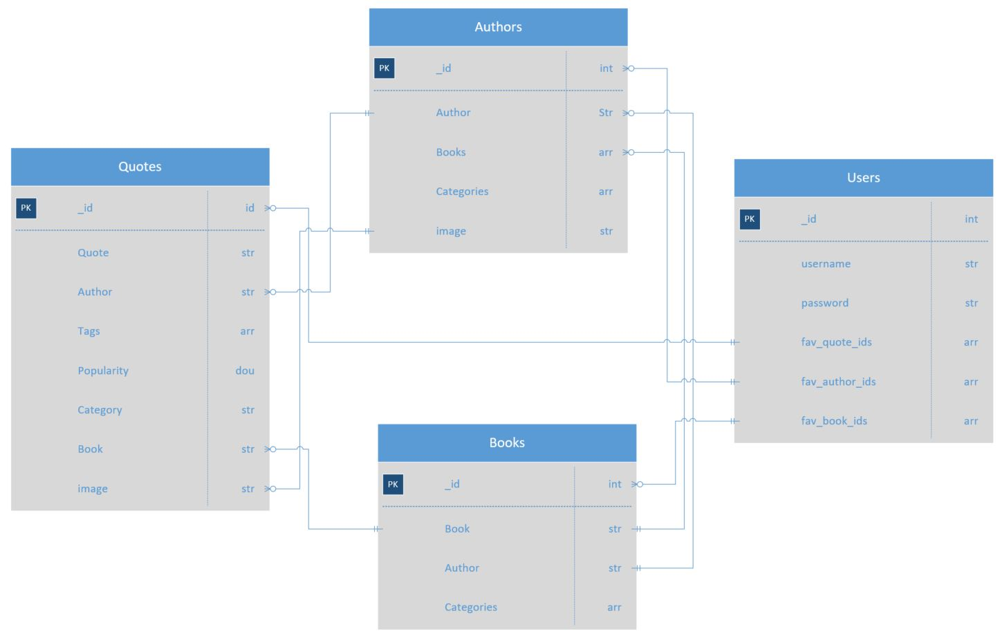

# Python and Data Centric Development Milestone Project 

<a href="https://ms3-quotes.herokuapp.com/" target="_blank">Visit Website</a> 
This website is collection of over 35,000 quotes gathered and organised based on author, book, categories and popularity. The website is a community by which users can store their favourite quotes,  books and authors. Users can also share quotes with friends and comment on authors and books to express their opinions. Users can use the “mood” sectionto discover favourite authors depending on how they feel.
This information is presented in an interactive, picturesque manner with a simple, easy on the eye design.

## Index
<a href="##UX">UX</a>
<a href="#Technologies Used">Technologies Used</a>
<a href="#Testing">Testing</a>
<a href="#Browsers">Browsers</a>
<a href="#Known bugs and issues">Known bugs and issues</a>
<a href="#Data schemes">Data schemes</a>
<a href="#Deployment">Deployment</a>
[Deployment](#2-Deployment)
<a href="#Credits">Credits</a>

## UX
When designing this website, I followed the 5 levels of development, a well know web design process mentioned in Jesse James Garrett's book, The Elements of User Experience. The planning of each of these planes are to follow the same order as below with each plane aligning to the previous plane’s requirements. This ensures that the main objectives for the website identified in the Strategy plane aligns all the way through to the Surface Plane which identifies the actual features on the website.

- Strategy Plane
- Scope Plane
- Structure Plane
- Skeleton Plane
- Surface Plane
- Strategy Plane

### Strategy Plane

#### Project Objectives

- Allow for users to browse and discover quotes, authors and books.
- Allow for users to register an account and login.
- Provide users with the functionality to save their favourite quotes, authors and books so that they can revisit for inspiration at any time.
- Easy sharing platform for quotes, authors and books.
- Create a community whereby users can comment and share their thoughts on authors and books.

#### User Stories
- As a visitor, I would like to browse and discover quotes which interest me so that I can find inspiration.
- As a visitor, I would like to save my favourite quotes/authors/books so that I can view at a later stage.
- As a visitor, I would like to discover quotes which coincide with the current mood I am experiencing so that I can find inspiration.
- As a visitor, I would like to search quotes/authors/books from the database so that I can research quotes in the database depending on my specific interest.
- As a visitor, I would like to register and login so that I can view my favourite quotes/authors/books.

### Scope Plane

The scope plane ensures that the website sections align to the objects and that these don’t grow in number throughout the project.
Necessary sections which align to the project objectives and user stories mentioned in the Structure plane.
For this project we will include all phase 1 sections and omit phase 2 sections until a later sprint due to resource capacity.

#### Phase 1

The first phase of the website will consist of 10 pages.

- Home
- Mood
- Authors
- Books
- Log in
- Register
- Individual Author Page
- Individual Book Page
- Users Private Profile page
- Share Quote page

#### Phase 2

Phase 2 will consist of upgrading the current pages. This will include increasing the number of author pictures. Allow for user profile image uploads and other functionalities below.

- Users Public Profile page
  - Allow user to upload profile picture
- Quote based on whether
  - Deliver a quote to the user depending on the weather in their location. For example, if it’s sunny/rainy, search the “Happiness”/”Inspiration tag.
- Improve individual book images
  - I used to materialize books icon with a rotation of colours for phase 1 but for phase 2 I intend to implement actual book images to give a more realistic effect.
- Improve Author profile
  - Can be done with Author profile information and uploading a new collection with information such as Author, DOB, Nationality etc.
- Allow for users to add their own quotes
  - Improve and increase the quotes database by allowing users to add quotes to the database.

### Structure Plane

The Structure plane is focused on taking the content selected from the scope plane and outlining how to portray this from a design aspect.

#### Design Process

- Considering the website consists of a collection of text, many pages will contain images to encourage engagement.
- The quote boxes will be an important aspect as these will present the collection of texts to the users.
- I have chosen an indigo/Lavender colour as the primary colour featuring as the Navbar and footer.
- This colour is also used on buttons and icons throughout the site.
- For font, a standard black is used for the quotes and text. For H2’s a Navy is used which contrasts wells with the lavender and is attention grapping. Sub heading and info messages are a lighter, less intense blue.
- Other colours chosen for the book icons, I selected using trial and error from the mycolor  pallet below.
  - https://mycolor.space/?hex=%237986CB&sub=1
- The Mood Board, Books and Authors pages all contain landing images whereas the home page include a “quote of the day” in large 'EB Garamond' font. This is used to portray the website concept on the main landing page.
- Materialize icons are used throughout.

### Skeleton Plane

Once the sections and layout has been identified as in the previous planes, we can get started with the Skeleton Plane. The Skeleton Planes outlines the arrangement of each section on the website and the best way to design these are by creating wireframes. I initially drew these wireframes before creating using Balsamiq software.
#### quotes.html (Homepage)
##### Desktop

##### Mobile

#### authors.html
##### Desktop

##### Mobile

#### books.html 
##### Desktop

##### Mobile

#### indiv_author.html 
##### Desktop

##### Mobile

#### profile.html 
##### Desktop

##### Mobile

#### mood.html 
##### Desktop

##### Mobile

### Surface Plane
The surface plane is the least conceptual plane and consists of the actual content and features on the website.

#### Features
- Navbar
  - A fixed Navbar with active classes so the user can tell what page they’re on. This renders for mobile with a slide out menu on the side
- Quote of the day
  - A Welcome Quote box to provide daily inspiration. This changes to a different quote each day. The same styling is implemented for the share quote page.
- Search
  - Considering the size of the database we have implemented search options for the Quotes, Authors and Books page so users can explore by wording or locate exact authors, books or quotes.
- Form
  - To meet the community-based requirements such as login, register and comment, forms will be imperative to feed information to the database.
- Copy quote link
  - I created an instant copy to clipboard link using a materialize icon in the quote box. This will allow the user to share the link of the quote with their friends (weather they have registered or not.
- Favourite icon
  - I have implemented a bright yellow favourited icon using Font Awesome. This animates to a glowing yellow when checked. When checking, this also feeds the information to store this as the users favourite in the database.
  - “Toast” prompt messages also pop up to inform the user when added or removed. For logged out customers, it also informs the user with relevant information.
- Mood board
  - The mood board is the most interactive feature and great for users who don’t have any particular authors in mind and would like to stumble upon a treasure of quotes.
  - It consists of a welcome image and 16 options taken form the most frequently mentioned tags throughout the database.
  - When the user selects the “Generate Quotes” button, these tags search the database and return the most relevant quotes to these queries.
  - The user can go back and play around with the remaing tags.
- Mood board Carousel
  - The 16 options would look like overkill but this range of tags is necessary to ensure the search returns depth in the choice of quotes. For this reason, I included these tags on an interactive carousel (8 on each side) so the user can browse and select moods in an interactive manner.
  - The search logic behind this board is that the highlighted tags are fed into an index created in the quotes collection which returns results based on a text index for quote, author and tags.
- Search features
  - The user may have a specific Author, book or quote in mind, for this reason, we have included 3 different search bars throughout the website.
  - Quotes: This search bar is the on the homepage for the user, it returns results based on a text index for quote, author and tags.
  - Author: On the Author page this search bar returns results for based on a text index for author name only.
  - Book: On the Book page, this search bar returns results based on a text index for Book name only.
- Comment
  - In addition to the previously mentioned comments form, the comments section is visible at the bottom of the specified books page and the individual authors page which shows the posted comments.

### Technologies Used

- HTML Used to add content to the website.
- CSS Used to add structure and design to my site.
- JavaScript & jQuery Used for the below features
  - Favourite Star: AJAX was used to send information to the python function.
  - Toast Messages
  - Share Quote link
  - Mood Board Carousel Slider
- Python
  - Used python for the backend elements of the Website used to interact with the database and feed data depending on users’ interactions.
  - Python (Pymongo) was also used from a data analytics perspective for organising and manipulating the database.
- Mongo DB
  - Mongo DB was used to the upload the JSON format, store the database and also to connect with the python code to Create, Read, Update and Delete any necessary documents.
  - Also used to allow me to create and search indexes.
- Flask
  - Flask and the Jinja Templating Language is used to allow for the high volume of information feed through to the HTML template pages.
- Heroku
  - Heroku is used to deploy and host the website.
- Werkzeug
  - Used to securely encrypt and stored passwords.
- Materialize was used throughout the website to easily implement attractive and consistent designs. The Materialize Grid System was implemented throughout.
  - Navbar
  - Carousel
  - Forms
  - icons
- Font Awesome
  - Font Awesome was used for the favourite star animation
- Balsamiq
  - Used in the design process for wireframes.
- Pxhere, Pexels, Unsplash, Wikipedia 
  - Used for images and design inspiration.
- GitPod
  - Used to create, commit and push the HTML, CSS, JavaScript and Python changes for the website.
- GitHub
  - Used to store files and code.
- Stackoverflow
  - Used for problem solving to implement desired designs.
  - Used to gain better understanding of how I should approach the implementation of elements.
- W3Schools
  - Used to gather a theoretical knowledge of elements and effects.
- W3 HTML Validator
  - Used throughout the project to ensure I was following best practices with HTML code.
- Jigsaw CSS Validator
  - Used throughout the project to ensure I was following best practices with CSS code.
- JSHint JavaScript Validator
  - Used this GitPod extension throughout the project to ensure I was following best practices with JavaScript code.
- Colors.share
  - Used to extract colour schemes to trial.
- Kaggle
  - Used to browse and discover a wealth of databases
- Google Fonts
  - Used for font implementation and inspiration.
- http://techsini.com/
  - Used for Responsive Theme image at beginning of this ReadME.

### Testing

#### Testing User Stories
##### As a visitor, I would like to browse and discover quotes which interest me so that I can find inspiration.
- Go to the website homepage
- If logged in with no favourited quotes or logged out, you can browse and discover quotes in order of popularity.

- If you are logged in and have favourited quotes you can click the “View Popular Quotes” link where you can discover quotes in order of popularity.
- This will provide 20 pages of inspirational quotes.
- The search box can also be used to enter terms to discover quotes depending on a specific category.

- The Author name can also be selected to route you to a page showing quotes and books exclusively from this Author.
- Links to Similar Authors pages can also be chosen.

##### As a visitor, I would like to save my favourite quotes/authors/books so that I can view at a later stage.
- Adding Quote
  - When logged in and the user sees a quote they like, select the star at the top right-hand corner of the quote box.

  - Select the star.
  - The star will glow yellow and a confirmation “Added to Favourites toast message will appear.

- Adding Author
  - When logged in and the user sees an Author they like, select the star at the right-hand corner of the quote box.

  - The star will glow yellow and a confirmation “Added to Favourites toast message will appear.

- Adding Book
  - When logged in and the user sees a book they like, select the link to the book page
  - To the right-hand side of the main book icon the user cans select this star.
  - The star will glow yellow and a confirmation “Added to Favourites toast message will appear.

- View favourites
  - When the user is signed in, they can go to the ‘profile’ page to see their favourited items.
  - The first heading will show the users favourited quotes.
  - The second heading will show the users favourited Authors
  - The third heading will show the users favourited Books

##### As a visitor, I would like to discover quotes which coincide with the current mood I am experiencing so that I can find inspiration.
- Open the Mood page which can be located in the navbar.
- The mood page will show a series of tags on the mood board.
- The user can select the tags which coincide with their current mood.
- They can then select the “generate mood” button.

- When they scroll down, they can find inspiration in the quotes shown to them.

##### As a visitor, I would like to search quotes/authors/books from the database so that I can research quotes in the database depending on my specific interest.
- The user can use the homepage search bar to search Quotes, tags and Authors.

- The user can use the Authors.HTML search bar to search by Author only.

- The user can use the Books.HTML search bar to search by Book only.

##### As a visitor, I would like to register and login so that I can view my favourite quotes/authors/books.
- The user can register by selecting the register button in the navbar.

- They can enter relevant info into the form as per below.

- If the username is unique and the input passes the validation, they will see the alert as per below.

- As they select favourited quotes/authors/books they can view at a later stage on the profile page.

### Browsers
Tested and working consistently on the below browsers for desktop.

- Google Chrome
- Microsoft Edge
- Firefox

- Mobile version manually tested throughout using google chrome on Xiaomi 8 and One Plus 9.
- Tested on below screen sizes using Google Chrome developer tools.
  - Moto G4
  - Galaxy S5
  - Pixel 2
  - Pixel 2 XL
  - iPhone 5/SE
  - iPhone 6/7/8
  - iPhone 6/7/8 Plus
  - iPhone X
  - iPad
  - iPad Pro
  - Surface Duo
  - Galaxy Fold

- The project passed the below validation tests. Please see below links to view validation screenshot.

  - W3 HTML Validator: https://validator.w3.org/
    - Validation was complete by using URL to avoid false error flagging from Jinja templating l.anguage

   - <a href="static/images/user-story-testing/quotes-validator.JPG" target="_blank">quotes.html Validator success</a>
   - <a href="static/images/user-story-testing/authors-validator.JPG" target="_blank">authors.html Validator success</a>
   - <a href="static/images/user-story-testing/books-validator.JPG" target="_blank">books.html Validator success</a>
   - <a href="static/images/user-story-testing/indiv_author-validator.JPG" target="_blank">indiv_author.html Validator success</a>
   - <a href="static/images/user-story-testing/indiv_book-validator.JPG" target="_blank">indiv_book.html Validator success</a>
   - <a href="static/images/user-story-testing/mood-validator.JPG" target="_blank">mood.html Validator success</a>
   - <a href="static/images/user-story-testing/profile-validator.JPG" target="_blank">profile.html Validator success</a>
   - <a href="static/images/user-story-testing/login-validator.JPG" target="_blank">login.html Validator success</a>
   - <a href="static/images/user-story-testing/register-validator.JPG" target="_blank">register.html Validator success</a>

  - Jigsaw CSS Validator: https://validator.w3.org/
   - <a href="static/images/user-story-testing/css-validator.JPG" target="_blank">CSS Validator success</a>

- JSHint JavaScript Validator: https://jshint.com/

  - js jint gitpod extention highlights no JS errors

### Known bugs and issues
- W3 HTML Validator Warnings
  - All pages have a "Section lacks heading. Consider using h2-h6 elements to add identifying headings to all sections.". This is because flash messaged are stored in a section container and when the flash messages are not activated the H element in which they are stored in is not visible.
- Foreign Language Authors
  - When authors with Foreign Language (such as arabic) is selected the page returned "Not Found". I believe this is due to an incompatability between the foreign Language and the database. This is for a tiny minority of the websites pages, however I intend to investigate this issue at a later point.
- Narrow screen issue
  - Author Box: for some very narrow screens the author box can become distored and the text may overlap the image. I will make no changed from this as the mobile version benefits from having these images and it occurs on a iregularly small screen size.
- Share link
  - The share link should sit vertically below the star however this was difficult to position on a all screen sizes due to the differing nature of both items elements. I will revisit this at a later time.

### Data schemes
The database is stored and hosted by MongoDB.
The database was downloaded in JSON format from Kaggle, before being pasted to my data.txt file.
Addition cleaning and preparation of the data was complete by using the mongo.py file which include removing dupes, creating additional collections and separating the values.
For example the Author section contained the authors name and the book title (if any), so a split action was needed here before creating a new "book" key
The cluster used for this project contains 4 collections in total which are shown in the data schema diagram below.

### Deployment 
#### Working with the local Copy
- Install the requirements based on librarys needed by using the pip3 install -r requirements.txt command.
- A data base will be needed to work off for a local file, this can be created using MongoDB by following the below instructions.
  - Create a MongoDB account.
  - Create a cluster.
  - Create 4 collections; authors, books, quotes and users.
  - Set values for these collections as content for the website.
- The environment variables will then be needed to allow the website to access the database. Please follow the below instrutions.
  - Create a .gitignore file.
  - Type "env.py" in the .gitignore file to ensure this is being ignored.
  - Create the env.py file.
  - This is where you can insert the following environment variables; IP, PORT, SECRET_KEY, MONGO_URI, MONGO_DBNAME.
- The app can now be ran via the terminal, create the app.py file and enter the command "python3 app.py" and run the app.

#### Heroku Deployment
- To deploy the project to Heroky a local workspace will be needed to ensure the Heroku can run the backend code.
- This can be done by using the command "pip3 freeze -- local > requirements.txt" which will populate the file convieniently to provide heroku with information on what needs to be installed.
- To ensure Heroku knows that the app.py file is the main file and entry for this project, the Procfile will be needed by logging the following command, "python app.py > Procfile"

- The next step involves creating a heroku account.
  - Go to heroku.com
  - Set up and account, create an app by following the instructions and enter any relevant information requested.
  - Deploy the app on Github to ensure any updates on github will link to Heroku (reducing the risk for discrepencies)
   - This can be done by selecting "Connect to GitHub" in the deploy tab and selecting the relevant repository. 
  - Locate the Config variables in the settings section, click "Reveal Config Vars".
  - Enter the previously mentioned variables which are present in the env.py file; IP, PORT, SECRET_KEY, MONGO_URI, MONGO_DBNAME
   - Ensure these values those of which present in the env.py file.
   - Also ensure the requirments.txt and Procfile are pushed into the live environment by using the below set of commands.
    - $ git add requirements.txt
    - $ git commit -m "Add requirements.txt"
    - $ git add Procfile
    - $ git commit -m "Add Procfile" 
 - Enable automatic deployments on Heroky by going to the deploy tab, go to Automatic deployments and select enable.
 Heroku now has the relevant packages to be linked and host the website. You can locate the apps URL by selecting "Open App" on the right hand corner of your Heroku account.

#### Cloning the project
If you wish to clone this project, action the following instructions.

1. On the repository "Code" tab, select the "Code" option at the top right.
2. Copy the URL provided in the HTTPS section.
3. Open the GitPod (or favoured environment) terminal and change to the desired directory for the clone to be located. 
4. Enter command "git clone" and paste the previously copied URL.
5. Hit enter and the clone will be created.

### Credits
All quotes content was taken from the below Kaggle database from user Amit Mittal.
https://www.kaggle.com/akmittal/quotes-dataset
Images
Please see below image log for all used images. All images were reduced in quality by using https://picresize.com/ for a smoother user loading and user experience.
-	authors_welcome_image 	:	https://www.pexels.com/photo/ancient-antique-architectural-design-architecture-442420/ 
-	mood_welcome_image 	:	https://images.pexels.com/photos/395196/pexels-photo-395196.jpeg?auto=compress&cs=tinysrgb&dpr=2&h=650&w=940 
-	book_welcome_image 	:	https://images.pexels.com/photos/2908984/pexels-photo-2908984.jpeg?auto=compress&cs=tinysrgb&dpr=2&h=750&w=1260
-	avatar_icon.jpg	:	https://icon-library.com/icon/avatar-icon-free-26.html
-	dr._seuss 	:	https://upload.wikimedia.org/wikipedia/commons/thumb/1/18/Theodor_Seuss_Geisel_%2801037v%29.jpg/440px-Theodor_Seuss_Geisel_%2801037v%29.jpg 
-	marilyn_monroe 	:	https://upload.wikimedia.org/wikipedia/commons/thumb/4/4e/Monroecirca1953.jpg/440px-Monroecirca1953.jpg 
-	oscar_wilde 	:	https://cdn.pixabay.com/photo/2016/01/27/22/49/oscar-wilde-1165545_1280.jpg 
-	albert_einstein 	:	https://upload.wikimedia.org/wikipedia/commons/5/50/Albert_Einstein_%28Nobel%29.png 
-	bernard_m._baruch 	:	https://upload.wikimedia.org/wikipedia/commons/thumb/c/c8/BARUCH%2C_BERNARD_2.jpg/440px-BARUCH%2C_BERNARD_2.jpg 
-	marcus_tullius_cicero 	:	https://upload.wikimedia.org/wikipedia/commons/thumb/4/40/Cicero_-_Musei_Capitolini.JPG/460px-Cicero_-_Musei_Capitolini.JPG 
-	frank_zappa 	:	https://upload.wikimedia.org/wikipedia/commons/thumb/a/ae/The_famous_mustache_and_goatee.jpg/440px-The_famous_mustache_and_goatee.jpg 
-	mae_west 	:	https://upload.wikimedia.org/wikipedia/commons/thumb/f/fd/Mae_West_LAT.jpg/440px-Mae_West_LAT.jpg 
-	mahatma_gandhi 	:	https://upload.wikimedia.org/wikipedia/commons/thumb/7/7a/Mahatma-Gandhi%2C_studio%2C_1931.jpg/440px-Mahatma-Gandhi%2C_studio%2C_1931.jpg 
-	c.s._lewis 	:	https://upload.wikimedia.org/wikipedia/en/1/1e/C.s.lewis3.JPG 
-	j.k._rowling 	:	https://upload.wikimedia.org/wikipedia/commons/thumb/8/85/J._K._Rowlings_1999.jpg/340px-J._K._Rowlings_1999.jpg 
-	albert_camus 	:	https://upload.wikimedia.org/wikipedia/commons/thumb/0/08/Albert_Camus%2C_gagnant_de_prix_Nobel%2C_portrait_en_buste%2C_pos%C3%A9_au_bureau%2C_faisant_face_%C3%A0_gauche%2C_cigarette_de_tabagisme.jpg/440px-Albert_Camus%2C_gagnant_de_prix_Nobel%2C_portrait_en_buste%2C_pos%C3%A9_au_bureau%2C_faisant_face_%C3%A0_gauche%2C_cigarette_de_tabagisme.jpg 
-	eleanor_roosevelt 	:	https://upload.wikimedia.org/wikipedia/commons/thumb/2/22/Eleanor_Roosevelt_portrait_1933.jpg/440px-Eleanor_Roosevelt_portrait_1933.jpg 
-	mark_twain 	:	https://upload.wikimedia.org/wikipedia/commons/thumb/0/0c/Mark_Twain_by_AF_Bradley.jpg/440px-Mark_Twain_by_AF_Bradley.jpg 
-	elbert_hubbard 	:	https://upload.wikimedia.org/wikipedia/commons/thumb/8/82/Elbert_Hubbard_-_Project_Gutenberg_eText_12933.jpg/440px-Elbert_Hubbard_-_Project_Gutenberg_eText_12933.jpg 
-	maya_angelou 	:	https://upload.wikimedia.org/wikipedia/commons/thumb/4/4f/Angelou_at_Clinton_inauguration_%28cropped_2%29.jpg/440px-Angelou_at_Clinton_inauguration_%28cropped_2%29.jpg 
-	martin_luther_king_jr. 	:	https://upload.wikimedia.org/wikipedia/commons/thumb/0/05/Martin_Luther_King%2C_Jr..jpg/440px-Martin_Luther_King%2C_Jr..jpg 
-	ralph_waldo_emerson 	:	https://upload.wikimedia.org/wikipedia/commons/thumb/d/d5/Ralph_Waldo_Emerson_ca1857_retouched.jpg/440px-Ralph_Waldo_Emerson_ca1857_retouched.jpg 
-	h._jackson_brown_jr. 	:	https://upload.wikimedia.org/wikipedia/commons/c/cb/H._Jackson_Brown%2C_Jr..jpg 
-	andré_gide 	:	https://upload.wikimedia.org/wikipedia/commons/thumb/4/42/Andr%C3%A9_Gide.jpg/440px-Andr%C3%A9_Gide.jpg 
-	j.r.r._tolkien 	:	https://upload.wikimedia.org/wikipedia/commons/thumb/6/66/J._R._R._Tolkien%2C_1940s.jpg/440px-J._R._R._Tolkien%2C_1940s.jpg 
-	jane_austen 	:	https://upload.wikimedia.org/wikipedia/commons/thumb/c/cb/Jane_Austen%2C_from_A_Memoir_of_Jane_Austen_%281870%29.jpg/440px-Jane_Austen%2C_from_A_Memoir_of_Jane_Austen_%281870%29.jpg 
-	william_shakespeare 	:	https://upload.wikimedia.org/wikipedia/commons/thumb/a/a2/Shakespeare.jpg/440px-Shakespeare.jpg 
-	bil_keane 	:	https://upload.wikimedia.org/wikipedia/commons/thumb/7/7f/Bil_Keane_%281990%29.jpg/440px-Bil_Keane_%281990%29.jpg 
-	thomas_a._edison 	:	https://upload.wikimedia.org/wikipedia/commons/thumb/9/9d/Thomas_Edison2.jpg/440px-Thomas_Edison2.jpg 
-	elie_wiesel 	:	https://upload.wikimedia.org/wikipedia/commons/thumb/d/da/ELIE_WIESEL_%285112581267%29.jpg/440px-ELIE_WIESEL_%285112581267%29.jpg 
-	neil_gaiman 	:	https://upload.wikimedia.org/wikipedia/commons/thumb/b/bc/Kyle-cassidy-neil-gaiman-April-2013.jpg/440px-Kyle-cassidy-neil-gaiman-April-2013.jpg 
-	groucho_marx 	:	https://upload.wikimedia.org/wikipedia/commons/thumb/6/68/Groucho_Marx_-_portrait.jpg/440px-Groucho_Marx_-_portrait.jpg 
-	douglas_adams 	:	https://upload.wikimedia.org/wikipedia/commons/c/c0/Douglas_adams_portrait_cropped.jpg 
-	steve_martin 	:	https://upload.wikimedia.org/wikipedia/commons/thumb/0/0a/Steve_Martin%2C_2017-08-11.jpg/440px-Steve_Martin%2C_2017-08-11.jpg 
-	pablo_neruda 	:	https://upload.wikimedia.org/wikipedia/commons/thumb/8/86/Pablo_Neruda_1963.jpg/440px-Pablo_Neruda_1963.jpg 
-	friedrich_nietzsche 	:	https://upload.wikimedia.org/wikipedia/commons/thumb/1/1b/Nietzsche187a.jpg/440px-Nietzsche187a.jpg 
-	mother_teresa 	:	https://upload.wikimedia.org/wikipedia/commons/thumb/d/d6/Mother_Teresa_1.jpg/440px-Mother_Teresa_1.jpg 
-	sarah_dessen 	:	https://upload.wikimedia.org/wikipedia/commons/thumb/0/03/Sarah_Dessen_2017.jpg/440px-Sarah_Dessen_2017.jpg 
-	garrison_keillor 	:	https://upload.wikimedia.org/wikipedia/commons/thumb/4/49/GKpress.jpg/440px-GKpress.jpg 
-	george_r.r._martin 	:	https://upload.wikimedia.org/wikipedia/commons/thumb/e/ed/Portrait_photoshoot_at_Worldcon_75%2C_Helsinki%2C_before_the_Hugo_Awards_%E2%80%93_George_R._R._Martin.jpg/440px-Portrait_photoshoot_at_Worldcon_75%2C_Helsinki%2C_before_the_Hugo_Awards_%E2%80%93_George_R._R._Martin.jpg 
-	robert_a._heinlein 	:	https://upload.wikimedia.org/wikipedia/commons/b/bf/Heinlein-face.jpg 
-	jorge_luis_borges 	:	https://upload.wikimedia.org/wikipedia/commons/thumb/c/c6/Jorge_Luis_Borges.jpg/440px-Jorge_Luis_Borges.jpg 
-	suzanne_collins 	:	https://upload.wikimedia.org/wikipedia/commons/thumb/b/b9/Suzanne_Collins_David_Shankbone_2010.jpg/440px-Suzanne_Collins_David_Shankbone_2010.jpg 
-	anaïs_nin 	:	https://upload.wikimedia.org/wikipedia/commons/a/ab/Anaisnin.jpg 
-	jim_henson 	:	https://upload.wikimedia.org/wikipedia/commons/thumb/8/82/NHS_Jim_Henson_Display_%28cropped%29.jpg/440px-NHS_Jim_Henson_Display_%28cropped%29.jpg 
-	charles_m._schulz 	:	https://upload.wikimedia.org/wikipedia/commons/thumb/b/ba/Charles_Schulz_NYWTS.jpg/440px-Charles_Schulz_NYWTS.jpg 
-	pablo_picasso 	:	https://upload.wikimedia.org/wikipedia/commons/thumb/b/b8/Portrait_de_Picasso%2C_1908.jpg/440px-Portrait_de_Picasso%2C_1908.jpg 
-	lemony_snicket 	:	https://upload.wikimedia.org/wikipedia/en/1/1a/Patrick_Warburton_as_Lemony_Snicket.png 
-	woody_allen 	:	https://upload.wikimedia.org/wikipedia/commons/thumb/8/89/Woody_Allen_Cannes_2016.jpg/440px-Woody_Allen_Cannes_2016.jpg 
-	nicholas_sparks 	:	https://upload.wikimedia.org/wikipedia/commons/a/af/Nicholas-Sparks-Autograph-1-4-06.jpg 
-	cassandra_clare 	:	https://upload.wikimedia.org/wikipedia/commons/thumb/0/02/Cassandra_Clare_by_Gage_Skidmore%2C_2013_b.jpg/440px-Cassandra_Clare_by_Gage_Skidmore%2C_2013_b.jpg 
-	bob_marley 	:	https://images.unsplash.com/photo-1538598450935-581f6a5fa7e0?ixid=MnwxMjA3fDB8MHxwaG90by1wYWdlfHx8fGVufDB8fHx8&ixlib=rb-1.2.1&auto=format&fit=crop&w=766&q=80 
-	walter_m._miller_jr. 	:	https://upload.wikimedia.org/wikipedia/en/8/81/Walter-m-miller-1.jpg 
-	abraham_lincoln 	:	https://upload.wikimedia.org/wikipedia/commons/thumb/a/ab/Abraham_Lincoln_O-77_matte_collodion_print.jpg/440px-Abraham_Lincoln_O-77_matte_collodion_print.jpg 
-	haruki_murakami 	:	https://upload.wikimedia.org/wikipedia/commons/thumb/e/eb/Murakami_Haruki_%282009%29.jpg/440px-Murakami_Haruki_%282009%29.jpg 
-	markus_zusak 	:	https://upload.wikimedia.org/wikipedia/commons/thumb/9/99/Markus_Zusak_2019_%28cropped%29.jpg/440px-Markus_Zusak_2019_%28cropped%29.jpg 
-	alexandre_dumas-fils 	:	https://upload.wikimedia.org/wikipedia/commons/thumb/d/d1/Alexandre_Dumas_fils.jpg/440px-Alexandre_Dumas_fils.jpg 
-	virginia_woolf 	:	"https://upload.wikimedia.org/wikipedia/commons/thumb/0/0b/George_Charles_Beresford_-_Virginia_Woolf_in_1902_-_Restoration.jpg/440px-George_Charles_Beresford_-_Virginia_Woolf_in_1902_-_Restoration.jpg"
-	theodore_roosevelt 	:	https://upload.wikimedia.org/wikipedia/commons/thumb/6/64/President_Roosevelt_-_Pach_Bros_%28cropped%29.jpg/440px-President_Roosevelt_-_Pach_Bros_%28cropped%29.jpg 
-	shel_silverstein 	:	https://upload.wikimedia.org/wikipedia/commons/thumb/3/32/Portrait_of_Shel_Silverstein_in_c._1964_by_Jerry_Yulsman.jpg/440px-Portrait_of_Shel_Silverstein_in_c._1964_by_Jerry_Yulsman.jpg 
-	robert_fulghum 	:	https://upload.wikimedia.org/wikipedia/commons/thumb/1/1a/Robert_Fulghum.jpg/400px-Robert_Fulghum.jpg 
-	helen_keller 	:	https://upload.wikimedia.org/wikipedia/commons/thumb/3/3e/Helen_Keller_circa_1920_-_restored.jpg/440px-Helen_Keller_circa_1920_-_restored.jpg 
-	jodi_picoult 	:	https://upload.wikimedia.org/wikipedia/commons/thumb/3/38/Jodi_Picoult_as_the_2013_Harry_Middleton_Lecturer_DIG13478-016.jpg/440px-Jodi_Picoult_as_the_2013_Harry_Middleton_Lecturer_DIG13478-016.jpg 
-	stephenie_meyer 	:	https://upload.wikimedia.org/wikipedia/commons/thumb/6/63/Stephenie_Meyer_by_Gage_Skidmore.jpg/440px-Stephenie_Meyer_by_Gage_Skidmore.jpg 
-	ernest_hemingway 	:	https://upload.wikimedia.org/wikipedia/commons/thumb/2/28/ErnestHemingway.jpg/440px-ErnestHemingway.jpg 
-	a.a._milne 	:	https://upload.wikimedia.org/wikipedia/commons/thumb/e/e2/Milne-Shadowland-1922.jpg/440px-Milne-Shadowland-1922.jpg 
-	terry_pratchett 	:	https://upload.wikimedia.org/wikipedia/commons/thumb/7/7a/10.12.12TerryPratchettByLuigiNovi1.jpg/440px-10.12.12TerryPratchettByLuigiNovi1.jpg 
-	alfred_lord_tennyson 	:	https://upload.wikimedia.org/wikipedia/commons/thumb/9/98/Alfred_Tennyson%2C_1st_Baron_Tennyson_by_George_Frederic_Watts.jpg/440px-Alfred_Tennyson%2C_1st_Baron_Tennyson_by_George_Frederic_Watts.jpg 
-	charles_bukowski 	:	https://upload.wikimedia.org/wikipedia/en/e/e2/Charles_Bukowski_smoking.jpg 
-	stephen_chbosky 	:	https://upload.wikimedia.org/wikipedia/commons/thumb/9/94/Stephen_Chbosky%2C_Jericho_Panel_at_Comic_Con_SD_2006_cropped.jpg/440px-Stephen_Chbosky%2C_Jericho_Panel_at_Comic_Con_SD_2006_cropped.jpg 
-	benjamin_franklin_wade 	:	https://upload.wikimedia.org/wikipedia/commons/thumb/7/73/Benjamin_F_Wade_-_Brady-Handy.jpg/440px-Benjamin_F_Wade_-_Brady-Handy.jpg 
-	george_carlin 	:	https://upload.wikimedia.org/wikipedia/commons/thumb/8/8e/George_Carlin_1975_%28Little_David_Records%29_Publicity.jpg/440px-George_Carlin_1975_%28Little_David_Records%29_Publicity.jpg 
-	w.c._fields 	:	https://upload.wikimedia.org/wikipedia/commons/thumb/0/05/W._C._Fields_1938.jpg/440px-W._C._Fields_1938.jpg 
-	j.d._salinger 	:	https://upload.wikimedia.org/wikipedia/commons/thumb/9/93/J._D._Salinger_%28Catcher_in_the_Rye_portrait%29.jpg/440px-J._D._Salinger_%28Catcher_in_the_Rye_portrait%29.jpg 
-	margaret_thatcher 	:	https://upload.wikimedia.org/wikipedia/commons/thumb/3/3d/Margaret_Thatcher_stock_portrait_%28cropped%29.jpg/440px-Margaret_Thatcher_stock_portrait_%28cropped%29.jpg 
-	karl_a._menninger 	:	https://upload.wikimedia.org/wikipedia/commons/thumb/6/6b/DR._AND_MRS._KARL_MENNINGER_ATTENDING_THE_SECOND_ANNUAL_TALLGRASS_PRAIRIE_NATIONAL_PARK_CONFERENCE_HELD_AT_ELMDALE..._-_NARA_-_557149.jpg/440px-DR._AND_MRS._KARL_MENNINGER_ATTENDING_THE_SECOND_ANNUAL_TALLGRASS_PRAIRIE_NATIONAL_PARK_CONFERENCE_HELD_AT_ELMDALE..._-_NARA_-_557149.jpg 
-	victor_borge 	:	https://upload.wikimedia.org/wikipedia/commons/thumb/0/04/Victor-Borge.jpg/440px-Victor-Borge.jpg 
-	ivan_illich 	:	https://upload.wikimedia.org/wikipedia/en/7/70/Ivan_Illich.jpg 
-	henry_ford 	:	https://upload.wikimedia.org/wikipedia/commons/thumb/1/18/Henry_ford_1919.jpg/440px-Henry_ford_1919.jpg 
-	robert_green_ingersoll 	:	https://upload.wikimedia.org/wikipedia/commons/thumb/2/2a/Robert_G._Ingersoll_-_Brady-Handy.jpg/440px-Robert_G._Ingersoll_-_Brady-Handy.jpg 
-	henry_wadsworth_longfellow 	:	https://upload.wikimedia.org/wikipedia/commons/thumb/a/a7/Henry_Wadsworth_Longfellow%2C_photographed_by_Julia_Margaret_Cameron_in_1868.jpg/440px-Henry_Wadsworth_Longfellow%2C_photographed_by_Julia_Margaret_Cameron_in_1868.jpg 
-	saint_augustine 	:	https://upload.wikimedia.org/wikipedia/commons/thumb/e/ea/Saint_Augustine_by_Philippe_de_Champaigne.jpg/350px-Saint_Augustine_by_Philippe_de_Champaigne.jpg 
-	hunter_s._thompson 	:	https://upload.wikimedia.org/wikipedia/commons/thumb/b/b4/Hunter_S._Thompson%2C_Las_Vegas_1971.jpg/440px-Hunter_S._Thompson%2C_Las_Vegas_1971.jpg 
-	ambrose_bierce 	:	https://upload.wikimedia.org/wikipedia/commons/thumb/5/57/Abierce.jpg/440px-Abierce.jpg 
-	anne_morrow_lindbergh 	:	https://upload.wikimedia.org/wikipedia/commons/thumb/f/fb/Anne_Morrow_Lindbergh_LCCN2012647141_%28cropped%29.jpg/440px-Anne_Morrow_Lindbergh_LCCN2012647141_%28cropped%29.jpg 
-	agnes_repplier 	:	https://upload.wikimedia.org/wikipedia/commons/thumb/0/02/Agnes_Repplier_C.jpg/440px-Agnes_Repplier_C.jpg 
-	will_rogers 	:	https://upload.wikimedia.org/wikipedia/commons/thumb/f/f6/Will_Rogers_1922.jpg/440px-Will_Rogers_1922.jpg 
-	friedrich_durrenmatt 	:	https://upload.wikimedia.org/wikipedia/commons/thumb/d/d4/Friedrich_duerrenmatt_19890427.jpg/440px-Friedrich_duerrenmatt_19890427.jpg 
-	piet_mondrian 	:	https://upload.wikimedia.org/wikipedia/commons/thumb/8/83/Piet_Mondriaan.jpg/440px-Piet_Mondriaan.jpg 
-	john_wooden 	:	https://upload.wikimedia.org/wikipedia/commons/thumb/f/f2/John_Wooden.JPG/440px-John_Wooden.JPG 
-	herman_cain 	:	https://upload.wikimedia.org/wikipedia/commons/thumb/0/05/Herman_Cain_by_Gage_Skidmore_4.jpg/440px-Herman_Cain_by_Gage_Skidmore_4.jpg 
-	oliver_goldsmith 	:	https://upload.wikimedia.org/wikipedia/commons/thumb/f/f0/Oliver_Goldsmith_by_Sir_Joshua_Reynolds.jpg/440px-Oliver_Goldsmith_by_Sir_Joshua_Reynolds.jpg 
-	ludwig_van_beethoven 	:	https://upload.wikimedia.org/wikipedia/commons/thumb/6/6f/Beethoven.jpg/440px-Beethoven.jpg 
-	philip_johnson 	:	https://upload.wikimedia.org/wikipedia/commons/thumb/0/07/Philip_Johnson.2002.FILARDO.jpg/440px-Philip_Johnson.2002.FILARDO.jpg 
-	sid_caesar 	:	https://upload.wikimedia.org/wikipedia/commons/thumb/4/43/Sid_Caesar_-_1961.JPG/440px-Sid_Caesar_-_1961.JPG 
-	francoise_sagan 	:	https://upload.wikimedia.org/wikipedia/en/a/a3/Fran%C3%A7oise_Sagan.jpg 
-	charles_lindbergh 	:	https://upload.wikimedia.org/wikipedia/commons/thumb/7/75/Col_Charles_Lindbergh.jpg/440px-Col_Charles_Lindbergh.jpg 
-	paul_valery 	:	https://upload.wikimedia.org/wikipedia/commons/thumb/f/fa/Paul_Val%C3%A9ry_-_photo_Henri_Manuel.jpg/440px-Paul_Val%C3%A9ry_-_photo_Henri_Manuel.jpg 
-	robert_benchley 	:	https://upload.wikimedia.org/wikipedia/commons/8/84/Robert_Benchley_photographed_in_Vanity_Fair.jpg 
-	elizabeth_bibesco 	:	https://upload.wikimedia.org/wikipedia/commons/thumb/0/03/Elizabeth_Bibesco.jpg/440px-Elizabeth_Bibesco.jpg 
-	buddha 	:	https://upload.wikimedia.org/wikipedia/commons/thumb/f/ff/Buddha_in_Sarnath_Museum_%28Dhammajak_Mutra%29.jpg/440px-Buddha_in_Sarnath_Museum_%28Dhammajak_Mutra%29.jpg 
-	norman_cousins 	:	https://upload.wikimedia.org/wikipedia/commons/3/3a/Norman_Cousins.jpg 
-	frank_lloyd_wright 	:	https://upload.wikimedia.org/wikipedia/commons/thumb/3/30/Frank_Lloyd_Wright_portrait.jpg/440px-Frank_Lloyd_Wright_portrait.jpg 
-	irvin_s._cobb 	:	https://upload.wikimedia.org/wikipedia/commons/thumb/5/53/Irvin_S._Cobb_cph.3a42965.jpg/440px-Irvin_S._Cobb_cph.3a42965.jpg 
-	lord_acton 	:	https://upload.wikimedia.org/wikipedia/commons/thumb/1/1d/Picture_of_John_Dalberg-Acton%2C_1st_Baron_Acton.jpg/440px-Picture_of_John_Dalberg-Acton%2C_1st_Baron_Acton.jpg 
-	ray_bradbury 	:	https://upload.wikimedia.org/wikipedia/commons/thumb/6/69/Ray_Bradbury_%281975%29_-cropped-.jpg/440px-Ray_Bradbury_%281975%29_-cropped-.jpg 
-	billy_sunday 	:	https://upload.wikimedia.org/wikipedia/commons/thumb/6/68/Billy_Sunday_1921.jpg/440px-Billy_Sunday_1921.jpg 
-	alexander_pope 	:	https://upload.wikimedia.org/wikipedia/commons/thumb/5/5d/Alexander_Pope_by_Michael_Dahl.jpg/440px-Alexander_Pope_by_Michael_Dahl.jpg 
-	michael_dell 	:	https://upload.wikimedia.org/wikipedia/commons/c/ce/Michael_Dell_2010.jpg 
-	max_eastman 	:	https://upload.wikimedia.org/wikipedia/commons/thumb/d/d5/Max_Eastman.jpg/440px-Max_Eastman.jpg 
-	ferdinand_foch 	:	https://upload.wikimedia.org/wikipedia/commons/thumb/9/9f/Maarschalk_Ferdinand_Foch_%281851-1929%29%2C_Bestanddeelnr_158-1095_%28cropped%29.jpg/440px-Maarschalk_Ferdinand_Foch_%281851-1929%29%2C_Bestanddeelnr_158-1095_%28cropped%29.jpg 
-	theodor_adorno 	:	https://upload.wikimedia.org/wikipedia/commons/d/d9/Adorno.jpg 
-	mike_ditka 	:	https://upload.wikimedia.org/wikipedia/commons/thumb/e/ed/Mike_Ditka.jpg/480px-Mike_Ditka.jpg 
-	rumi	:	https://upload.wikimedia.org/wikipedia/commons/thumb/a/a0/Mevlana_Statue%2C_Buca.jpg/200px-Mevlana_Statue%2C_Buca.jpg
-	george_bernard_shaw	:	https://upload.wikimedia.org/wikipedia/en/thumb/3/30/Bernard-Shaw-ILN-1911-original.jpg/220px-Bernard-Shaw-ILN-1911-original.jpg
-	dalai_lama	:	https://upload.wikimedia.org/wikipedia/commons/thumb/5/55/Dalailama1_20121014_4639.jpg/220px-Dalailama1_20121014_4639.jpg

#### Acknowledgements
- Materialize: materializecss was used throughout for grid dspacing and designing elements.
  - Icons: Materialize icons were used for sidenav trigger, pagitation arrows, comment pencit icon, form send icon, mood carousel icon and generate mood quotes button.
    - https://materializecss.com/icons.html
  - Forms: used materialize with the help of code institute mini project for the login and register form elements.
    - https://materializecss.com/text-inputs.html
  - Mood Carousel: for rotating the mood carousel to provide more options.
    - https://materializecss.com/carousel.html#two!
  - Toast: Toast messages which are used to provide the user with information when likeing/unliking stars.
    - https://materializecss.com/toasts.html
 - Carousel Buttons: The fucnitonality for the Mood board caousel buttons was helped with Acknowledgement to the below codepen.
    - Paco Cervantes - https://codepen.io/Paco_Cervantes/pen/ZLxKpj 
- Mood Board Buttons Hover: The mood board hover funcitonality was create with help using the Radial-out funcituon below.
    - Radial-out option: https://ianlunn.github.io/Hover/
- Toast: Selecting the posiitoning of the toast messages was complete with the help of the below article.
    - https://stackoverflow.com/questions/33566041/materialize-css-change-position-of-toast-dialog
- Font awesome: Font awesome elements were implemented throughout. (book icon, share quote, search icon, facebook, instagram, email envelope, form user cog, form password lock, login/register button icons)
- Favourite Star: The favourite star was help implemented using font awesome and the below article help in implementing the backend messaging.
   - https://www.tutorialrepublic.com/faq/how-to-check-a-checkbox-is-checked-or-not-using-jquery.php
- Below 2 videos helped in sending data from jQuery AJAX to Python
   - https://www.youtube.com/watch?v=v2TSTKlrPwo
   - https://www.youtube.com/watch?v=XYx5sIbU8B4
- Quote of the data / Share Quote: The welcoming quote of the day and the share quote page was implemented using the below codepen.
  - Joe Hastings - https://codepen.io/JoeHastings/pen/MOdRVm 
- Quote Box / Author Box: The quote box and author box was implemented using the below CodePens for each device.
  - Desktop - Tigran Sargsyan - https://codepen.io/tiggr/pen/MWyJJEz
  - Mobile - Chris Smith - https://codepen.io/chris22smith/pen/oQWavL - Animated Border 
  - The Author box spacing was completed with thanks to the below forum.
    - Author Quote box desktop spacing - https://stackoverflow.com/questions/7537439/how-to-increment-a-variable-on-a-for-loop-in-jinja-template
- Pagination - Pagination for the quotes, authors, indiv_author, indiv_book and mood pages was completed with the help of the below forum
  - https://stackoverflow.com/questions/58031816/how-to-display-active-bootstrap-pagination-using-jinja-conditional 
- Colors.share: Color share was used for color inspiration throughout and I used the below series of gradients in deciding the book icon and bood button colors.
  - https://mycolor.space/?hex=%237986CB&sub=1
- Copy to clipboard share feature - The backend of the copy to clipboard feature was complete with help of the below board posts.
    - https://www.w3schools.com/howto/howto_js_copy_clipboard.asp
    - https://stackoverflow.com/questions/63033012/copy-the-text-to-the-clipboard-without-using-any-input
- Logged out favourite star -  The alert message backend was implemented with help of the below w3 schools page.
  - https://www.w3schools.com/js/tryit.asp?filename=tryjs_alert
- Comments - The comments user letter icon was complete with the help of the below page.
  - Letter icon - https://stackoverflow.com/questions/29980387/how-to-make-a-circle-around-a-letter/29980453

